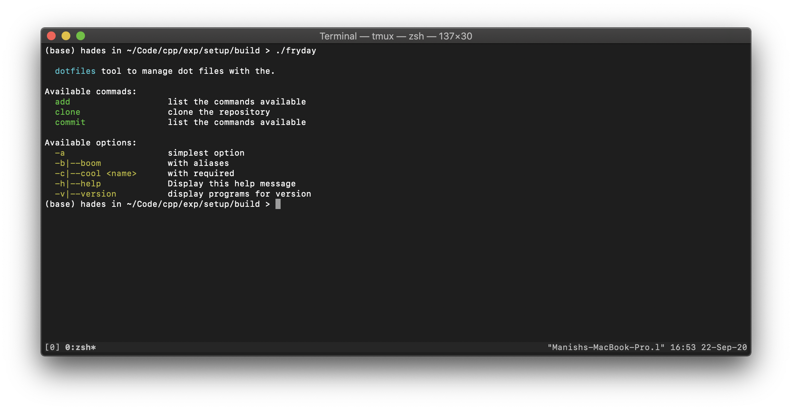

# cli-plus-plus
The complete solution for c++ command line interface, inspired by [ruby's commander](https://github.com/commander-rb/commander) and  [node.js's commander](https://github.com/tj/commander.js).

Cli++ provides a framework for building cli apps with expressive, elegant syntax. I’ve already laid the foundation — freeing you to create awesome cli applications without sweating the small things.

## Installation 
```bash
git clone https://github.com/manishsahani999/cli-plus-plus.git
```

Will be available on brew after first release.

## Usage 

Cli++ provides a Commander Class for quick cli app development. for demonstration 

```c++
#include <commander.hpp>

using namespace cli;

int32_t main(int argc, char *argv[])
{
    // dotfiles is the name of the program and second parameter is description.
    Commander program("dotfiles", "tool to manage dot files with the.");
}
```

### Version

The version method adds handling for displaying the command version. The default option flags are -v and --version, which can be overriden and when present the command prints the version number and exits.

```c++
program.version("1.0");
```

provide your own version flags 
```c++
program.version("1.0", "-v|--ver", "description for the version command.");
```

### Options 

Options are defined with the `.option()` method, also serving as documentation for the options. Each option can have a short flag (single or double character) and a long name, separated by a comma or space or vertical bar `|`.

Options can have parameters that can be required (`<required-arg>` - within `<>`)or optional 
(`[optional-arg]` - within `[]`).

Options on the command line are not positional, and can be specified before or after other command arguments.

```c++
program.option("-a", "simplest option");
program.option("-b, --boom", "with aliases");
program.option("-c, --cool <name>", "with a required parameter");
program.option("-d|--doom [party]", "with a optional parameter");
```

#### Access Option's arguments
The option's arguments can be accessed at runtime using `[]` operator on commander's object.

```c++
program.parse(argc, argv);

// To access party from doom
std::cout << program["party"];
```

#### Default option value
You can specify a default value for an option which takes a value.

```c++
program.option("-c, --cool <name>", "with a required parameter", "vim");
```

### Example 

```c++

#include <iostream>
#include <commander.hpp>

using namespace std;
using namespace cli;

/**
 *  This is an example demonstration to use the package, and is not included in
 *  the library.   
 */
int32_t main(int argc, char *argv[])
{
    Commander program("dotfiles", "tool to manage dot files with the.");

    try
    {
        program.version("1.0");
        program.option("-a", "simplest option");
        program.option("-b, --boom", "with aliases");
        program.option("-c, --cool <name>", "with required");
        // program.option("-d|--doom [party]", "optional");
        // program.option("-de| --doom [party]", "errored");
        program.command("clone <url> [path]", "clone the repository");
        program.command("add", "list the commands available");
        program.command("commit", "list the commands available");
        program.parse(argc, argv);
    }
    catch (const cli::Exception &e)
    {
        std::cerr << e.what() << '\n' << e.how() << "\n";
        exit(1);
    }

    if (program.command == "version") {
        cout << program["version"] << endl;
        return 0;
    }

    if (program.command == "clone") {
        cout << "Cloning from "  << program["url"] << endl;
        // do actual cloning
        return 0;
    }
    
    return 0;
}

```

